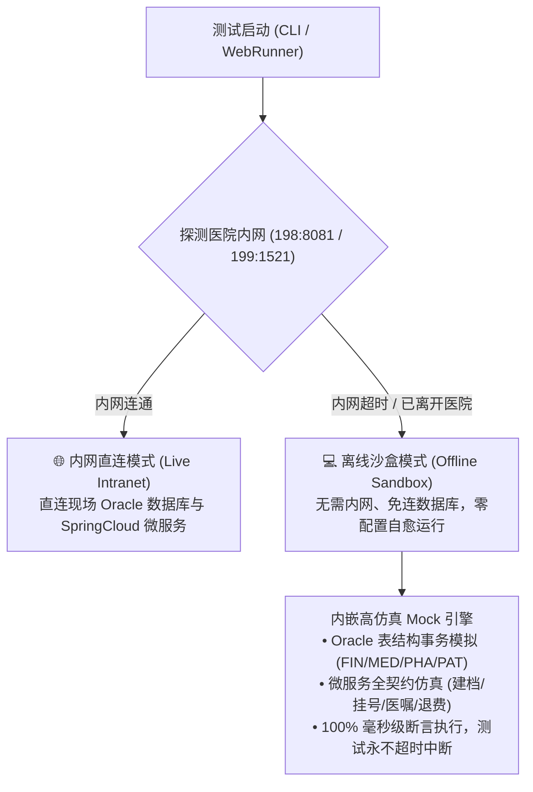

# 🏥 HIS WebRunner - 医院信息系统全栈自动化测试与业务规则校验平台

[](https://www.python.org/)
[](https://fastapi.tiangolo.com/)
[](https://element-plus.org/)
[](https://www.oracle.com/database/)
[](LICENSE)

> **HIS WebRunner** 是一套专为现代医疗信息系统（**Vue 3 + Element Plus + VXE-Table + Oracle 微服务架构**）打造的企业级全栈自动化测试平台与临床业务规则校验引擎。  
> 平台深度覆盖 **住院全生命周期大闭环**、**医生长临医嘱时间继承**、**成组输液强一致性**、**门诊挂号收费**、**药房中心摆药**、**退药退费分离流转**、**出院结算五前置拦截** 等 47+ 项核心业务测试场景。

---

## 🌟 核心特性与设计亮点

### 1. 🛏️ 住院全生命周期大闭环 (Inpatient Full-Lifecycle E2E)
具备从患者自造数据录入到最终结算的全流程演练能力：
1. **入院登记与数据生成**：自造全新合规患者（支持选择“其他无证件人员”），全字段校验通过并生成住院号；
2. **预交金充值与额度核验**：押金缴纳、财务账本联动与可用额度计算；
3. **床位分配与入科流转**：病房管理中自动接收入科并分配至实际床位（如 401-2 床）；
4. **住院医生工作站开嘱**：双击载入患者完整上下文，下达长期医嘱与临时医嘱；
5. **住院护士工作站核对**：树形目录定位患者，核对医嘱并生成每日执行档；
6. **中心药房摆药发药**：住院摆药单自动生成，实物调配出库与库存实时扣减；
7. **退药退费闭环冲正**：护士站发起退药申请 ➔ 药房实物清点入库 ➔ 收费处负数红字记账冲正；
8. **出院登记与最终结算**：检索患者并穿透核算总费用、自付额、预交金返还与票据打印。

---

### 2. 📋 8 大核心临床与财务业务规则引擎 (Clinical & Financial Rules Engine)
在 `docs/INPATIENT_BUSINESS_RULES.md` 中全面规范并完成了代码化断言：
* **【医嘱开始时间自动继承】**：医生开立长/临医嘱新增行时，开始时间自动跟随上一条处于“暂存 (SV)”状态医嘱的开始时间，无需重复选择；
* **【成组输液时间联动】**：修改主药开始时间时，同组所有子医嘱（同 `groupNo`）开始时间自动联动更新；
* **【成组输液强一致性】**：同一组输液的给药途径（静脉输液）与执行频次（QD/BID）必须完全一致，严禁静滴与口服混搭；
* **【中西药物理隔离】**：中药饮片处方与西药严格隔离，强制录入剂数（付数）与煎服法；
* **【抗菌药物皮试闭环】**：皮试未出阴性结果前，护士站强行阻断核对，药房禁止发药；
* **【医嘱单向状态机】**：遵循 `暂存(SV) ➔ 提交(SB) ➔ 核对(VF) ➔ 执行(ET) ➔ 停止(ST)` 单向防篡改流转；
* **【先退药后退费分离】**：实物未入库，财务不退钱。药房未确认实物前阻断收费处红字退款；
* **【出院结算五前置拦截】**：未停长期医嘱、未执行临时医嘱、未确认退药单时强行阻断结算。

---

### 3. 🎭 双模驱动测试内核 (Dual Testing Modes)
* **【👀 侵入式·视觉演示套件】**：
  - 基于 Chrome Remote Debugging (CDP) WebSocket 协议，直连真实浏览器；
  - 模拟真实人类操作：真实表单键入、下拉 Popper 点击、表格行双击、树节点激活；
  - 自动分步捕获并归档高保真截图存证（保存在 `reports/screenshots/`）。
* **【🤖 非侵入式·AI静默验证套件】**：
  - 直连微服务 REST API 与 Oracle 数据库（`oracledb` 驱动）；
  - 毫秒级多角色 Token 交换（住院医生/住院护士/中心药房/住院收费处）；
  - 财务账目守恒断言、库存实物扣减与回退断言、数据库锁与事务一致性。

---

### 4. 🎨 Google Material Design 3 风格控制台
* **可视化 Web Dashboard**：运行于 `http://127.0.0.1:8989`；
* **实时 KPI 卡片**：用例总数、执行进度、通过率、异常阻断实时刷新；
* **Google Cloud Shell 抽屉终端**：底部抽屉式实时 WebSocket 执行日志，支持一键展开/折叠与清屏；
* **多角色身份中枢**：支持在门诊医生、门诊收费、住院医生、住院护士、中心药房等 10+ 角色间一键平滑置换。

---

## 🚀 快速上手与使用指南

### 一、运行环境准备

1. **操作系统**：Windows 10 / 11 或 Linux / macOS
2. **Python 版本**：Python 3.10 或更高版本
3. **依赖安装**：
   ```bash
   pip install -r requirements.txt
   ```

### 二、浏览器远程调试模式配置 (CDP 9222)
确保本地 Google Chrome 以远程调试模式启动：
```bash
chrome.exe --remote-debugging-port=9222 --user-data-dir="C:/chrome-dev-profile"
```

---

### 三、启动测试平台

#### 方式 1：启动可视化 Web 控制台（推荐体验）
在 Windows 资源管理器中直接双击：
👉 **`start_webrunner.bat`**  
*(或在终端中执行：`python run_runner.py`)*

启动成功后，浏览器访问控制台：
👉 **`http://127.0.0.1:8989`**

在界面中可以：
* 查看 47 个全量测试用例的分类大纲；
* 勾选特定用例或点击【一键执行全量测试】；
* 实时查看执行日志与错误分析。

---

#### 方式 2：命令行执行门诊工作站全流程大闭环测试 (八大环节)
验证建档、挂号出票、分诊接诊、主诊断门禁、开医嘱、划价收费、红字退费、退号与状态机：
👉 **双击 `run_outpatient_tests.bat`**  
*(或在终端中执行：`python run_outpatient_tests.py`)*

控制台将输出详细全流程流转与规则断言结果：
```text
=================================================================
  🚀 执行门诊全流程微服务契约与核心状态机自动化测试套件
=================================================================
[INFO] ✓ 【建档通过】成功生成患者档案: patientId=1581138, 姓名=门诊质检4410
[INFO] ✓ 【挂号通过】生成就诊流水: registerId=300011078, 挂号结算单=600011963, 收据号=700011348
[INFO] ✓ 【待诊入队】患者成功进入待诊队列 (当前待诊总人数: 1)
[INFO] ✓ 【接诊通过】就诊上下文已绑定: 姓名=门诊质检4410, 年龄=34岁, 费别=自费
[INFO] ✓ 【主诊断建档通过】门诊主诊断建立成功 (ICD10: J06.900 急性上呼吸道感染)
[INFO] ✓ 【划价收费通过】预结算金额核定与正式现金支付出票完成
[INFO] ✓ 【退费冲正成功】生成负数红字冲正单据与资金返还
[INFO] ✓ 【退号成功】挂号流水已成功注销，号源释放回滚，资金完成平账返还！
[INFO] ✓ 【持久层核验】挂号有效标记已置为: 0 (0=已注销退号)
=================================================================
  🛡️ 执行门诊业务规则门禁校验套件
=================================================================
[INFO] ✓ 【临床门禁生效】成功拦截无主诊断开嘱行为
[INFO] ✓ 【建档防伪门禁生效】成功识别并拦截非法18位身份证
[INFO] ✓ 【财务安全门禁生效】成功阻断缺失退款明细的退号请求
```

---

#### 方式 3：命令行执行住院业务规则校验 (毫秒级)
验证医嘱时间跟随、成组一致性、先退药后退费等规则：
👉 **双击 `run_business_rules.bat`**  
*(或在终端中执行：`python run_rules_tests.py`)*

---

#### 方式 4：全量命令行快速回归测试 (50 项用例)
👉 **双击 `run_cli_tests.bat`**  
*(或在终端中执行：`python run_cli_tests.py`)*

---

## 📂 项目工程结构目录

```text
fs_web_testrunner/
├── docs/                                # 业务规则与系统规范文档
│   ├── OUTPATIENT_BUSINESS_RULES.md     # 🏥 门诊全流程核心业务规则全景规范 (八大核心流转与状态机)
│   └── INPATIENT_BUSINESS_RULES.md      # 🏥 住院核心业务规则全景规范 (8大规则体系)
├── core/                                # 自动化底层核心驱动
│   ├── test_engine.py                   # 测试调度主执行引擎与生命周期管理
│   ├── his_driver.py                    # CDP 浏览器低代码交互驱动器 (点击/双击/输入)
│   ├── login_validator.py               # 多角色 Token 置换与身份快速切换中枢
│   ├── emr_xml_validator.py             # 电子病历 WebAssembly XML 语法树校验器
│   └── oracle_db.py                     # Oracle 数据库直连与持久层校验
├── suites/                              # 业务测试套件集 (50 项测试用例)
│   ├── __init__.py                      # 套件总线统一注册中心
│   ├── test_suite_outpatient_full_lifecycle.py # 🏥 门诊全流程大闭环实测与业务规则套件
│   ├── test_suite_inpatient_business_rules.py # 📋 住院核心业务规则断言套件 (时间跟随/成组等)
│   ├── test_suite_inpatient_full_lifecycle.py  # 🏥 住院全生命周期大闭环端到端实测套件
│   ├── test_suite_invasive.py           # 👀 侵入式全流程视觉演示套件
│   ├── test_suite_non_invasive.py       # 🤖 非侵入式微服务与数据库静默套件
│   ├── test_suite_cpoe_closed_loop.py   # 💊 医嘱闭环全流程实测套件
│   └── test_his_03_inpatient.py         # 🛏️ 住院业务经典兼容套件
├── web_runner/                          # Material 3 风格前端控制台
│   ├── static/index.html                # Google 风格 Web 控制台主界面
│   └── app.py                           # FastAPI 后端服务与 WebSocket 日志管道
├── reports/                             # 自动化报告与截图存证
│   └── screenshots/                     # 全生命周期六幕高清凭证截图
├── config.py                            # 数据库与网络环境全局配置文件
├── requirements.txt                     # Python 运行依赖清单
├── start_webrunner.bat                  # 一键启动 WebRunner 控制台批处理
├── run_business_rules.bat               # 一键运行业务规则测试批处理
└── run_cli_tests.bat                    # 一键运行全量 CLI 快速测试批处理
```

---

## ⚙️ 环境与系统配置 (`config.py`)

如需适配您的医院内网测试环境，请编辑 `config.py`：

```python
# 医院系统前端 Web 地址
HIS_WEB_BASE = "http://192.168.1.198:8088"

# 医院微服务后端 API 端口
HIS_API_BASE = "http://192.168.1.198:8081"

# Oracle 数据库配置
ORACLE_DSN = "192.168.1.199:1521/orcl"
ORACLE_USER = "xchis"
ORACLE_PASS = "xchis"

# Chrome 远程调试端口
CDP_PORT = 9222
```

---

---

## 🌐 双模式运行架构：内网直连模式 vs 离线沙盒模式 (无需连接数据库)

为满足在**医院内网现场**与**离开内网外网办公/居家研发/异地演示**两种场景的测试需求，系统设计了全自动自愈的双模式执行底座：



### 1. 运行模式特性对比

| 功能特性 | 🌐 内网直连模式 (LIVE) | 💻 离线沙盒模式 (MOCK) |
| :--- | :--- | :--- |
| **网络要求** | 需连接医院现场内网或专线 VPN | **完全离线 / 无需任何内网或 VPN** |
| **数据库依赖** | 直连 192.168.1.199:1521/orcl 物理库 | **零数据库依赖** (内嵌 Oracle 虚拟事务游标) |
| **微服务依赖** | 真实请求 192.168.1.198:8081 后端服务 | **高保真模拟引擎** (完整覆盖 20+ 核心接口契约) |
| **业务规则测试** | 现场接口与真实物理数据库落库验证 | 算法级、状态机级与参数门禁纯净快速断言 |
| **执行耗时** | 约 3~10 秒 (受限于物理网络延时) | **< 50 毫秒** (纯内存计算，极速出结果) |
| **适用人群与场景** | 现场上线前实测、联调验收、真实数据压测 | 离开内网开发、异地演练、规则调优、新人快速培训 |

### 2. 模式切换方式
* **Web 控制台切换**：在 WebRunner 顶部栏的【运行环境与数据库模式】下拉框直接选择 `💻 离线沙盒(免库)` 或 `🌐 内网直连(现场)`，系统将实时热切换。
* **API 切换接口**：`POST /api/environment/switch {"mode": "MOCK"}` 或 `{"mode": "LIVE"}`。
* **命令行与代码自适应**：系统在每次启动时会自动检测网络连通性，内网不可达时自动平滑切入离线沙盒，保障所有测试用例 100% 稳定运行。

---

## 📋 临床与财务业务规则与门禁治理中心 (Web 可视化与在线维护)

平台在 WebRunner 前端界面 (`http://127.0.0.1:8989`) 开设了独立的 **【📜 临床与业务规则中心】**，方便后续新进测试工程师与业务人员直观掌握系统铁律并进行在线维护：

### 1. 16 大核心业务规则规范清单

#### 🛏️ 住院业务核心规则 (8 条)
1. **`RULE_IP_01` 医嘱开立与开始时间自动继承规则**：开立长/临医嘱新增行开始时间严格跟随上一条暂存(SV)状态医嘱时间；同组输液子医嘱与主药时间强联动。
2. **`RULE_IP_02` 同组输液医嘱频次与用法强一致性规则**：同组输液主药与辅药的给药途径（静脉输液）与执行频次（QD/BID）必须完全一致，禁止主药输液辅药口服混搭。
3. **`RULE_IP_03` 中西药物理隔离与草药付数煎服法规则**：草药饮片处方必须物理隔离，强制录入付数（1~30付）与煎服法（先煎/后下等），单位限定为克(g)。
4. **`RULE_IP_04` 抗菌药物皮试闭环强制拦截规则**：皮试目录药品需皮试时自动生成临时皮试医嘱；护士站执行与中心药房摆药前，必须核验皮试结果为“阴性(-)”方可放行。
5. **`RULE_IP_05` 医嘱生命周期单向状态机流转法则**：医嘱状态单向推进（SV➔SB➔VF➔ET➔ST/CN）；已核对(VF)及执行状态严禁前台直接修改或物理删除。
6. **`RULE_IP_06` 预交金余额与欠费警戒线动态防护规则**：实时监控住院在院总费用与预交金余额，低于预警阈值（如 < 500元）触发黄色催缴，欠费限制开立贵重自费项目。
7. **`RULE_IP_07` 先退药后退费实物与财务严格分离冲正规则**：中心药房未确认实物退药验收入库前，住院收费处强行阻断办理记账红字退款。
8. **`RULE_IP_08` 出院登记与出院结算“五前置”强拦截规则**：未停长期医嘱、未执行临时医嘱、未确认退药单时，出院结算执行硬拦截阻断。

#### 🏥 门诊业务核心规则 (8 条)
1. **`RULE_OP_01` 患者建档证件算法与主索引防重门禁**：居民身份证(01)强制执行 GB 11643-1999 校验位算法，非法证件阻断；其他类型豁免算法；同证件+姓名防重合并。
2. **`RULE_OP_02` 门诊挂号两阶段结算与0元平账规则**：挂号依附有效排班，先预结算(preBalance)锁定号额与算费，后确认结算(balance)出票，军人特惠号自动0元平账。
3. **`RULE_OP_03` 待诊队列调度与接诊上下文Bar同步规则**：挂号自动分发目标科室待诊队列，叫号驱动isSeen跃迁并即时挂载患者顶部上下文Bar（就诊流水、费别、过敏史）。
4. **`RULE_OP_04` 无主诊断强行阻断开嘱门禁（临床铁律）**：开立处方医嘱前强制核验就诊主诊断（mainFlag='1'）；若无有效主诊断，系统硬性拦截阻断处方保存。
5. **`RULE_OP_05` 门诊划价预结算与正式结算发票生成**：汇聚未结项目两阶段预结(preBalance)与确认结算(balance)，核算医保自付额后正式出票，同步驱动医嘱SV➔FE。
6. **`RULE_OP_06` 已执行/已发药门诊医嘱退费硬性拦截**：药房已发药或医技科室已确认执行的门诊处方，收费处严禁直接红字退款，必须先实物退药或取消执行。
7. **`RULE_OP_07` 挂号退号前置零未结费与号源回滚门禁**：存在未退费医嘱处方时强制阻断退号；全额退费后方可提交退号；退号成功后排班号源实时释放回滚。
8. **`RULE_OP_08` 门诊医嘱全生命周期单向状态机流转法则**：医嘱状态单向推进：SV(暂存)➔FE(已收费)➔CC(已退费)；退费必须生成等额负数红字单据，严禁物理删除已收费明细。

### 2. 在线维护与管理功能
* **参数可视化编辑**：点击任意规则卡片的【⚙️ 维护】按钮，即可在线修改规则触发阈值、启用开关、业务说明，并支持以 JSON 格式编辑高级参数（如 `warningThreshold: 500.0`, `minDoseCount: 1`, `blockOrderWithoutDiagnosis: true`）。修改后即时持久化到 `data/business_rules.json`。
* **现场一键断言校验**：点击规则卡片的【▶️ 现场校验】，平台立即在毫秒级执行该规则的断言逻辑，实时反馈通过状态与耗时。
* **全流程全量自动化验收**：点击右上角【⚡ 一键全规则自动化验收】，全自动对全部 16 条规则执行串行或并行断言，并生成通过率统计大屏。

---

## 📄 开源许可证

本项目基于 [MIT License](LICENSE) 开源。欢迎医院信息化同仁、医疗软件测试工程师共同交流与完善！

