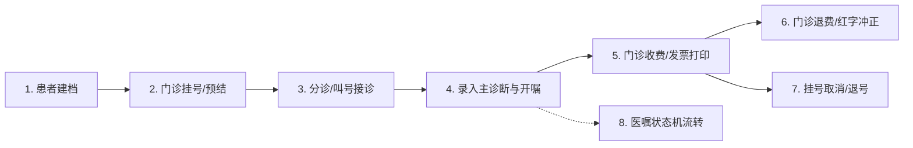

# 🏥 医院门诊工作站全流程业务规则与状态机规范手册
## (Outpatient Full-Lifecycle Business Rules & Order State Machine Specification)

---

## 📌 概述 (Overview)

门诊业务是医院信息系统（HIS）中吞吐量最大、实时性要求最高的业务板块，横跨 **门诊挂号收费处**、**分诊台**、**门诊医生工作站**、**医技检查/检验科室**、**门诊药房** 等多个临床与财务部门。

本手册全面梳理并固化门诊全生命周期八大业务核心环节的业务规则、门禁拦截逻辑与状态机流转机制。

---

## 📋 八大业务环节全景流转与规则规范

### 1. 📇 患者建档流程与规则 (Patient Archiving)
* **规则 1.1【证件合法性强校验】**：
  - 证件类型为 `01`（居民身份证）时，系统前端与后端均对 18 位身份证执行 GB 11643-1999 校验码算法（ISO 7064:1983.MOD 11-2）；
  - 证件类型为 `09`（其他无证件人员/新生儿）时，豁免 18 位校验码，支持医院内部虚拟临时主索引发卡。
* **规则 1.2【患者主索引唯一性】**：
  - 同一医院内通过证件号码 + 姓名执行防重校验，命中已有档案时执行主索引合并，严禁生成重复的 `patientId`。

---

### 2. 🎟️ 门诊挂号与号源管理 (Registration & Appointment)
* **规则 2.1【排班与号源池锁定】**：
  - 挂号必须依托于有效排班（`scheduleId`）或科室医生现场加号规则；
  - 挂号分为两个阶段流转：
    1. **挂号前置预结算 (`preBalance`)**：校验号源限额、计算挂号费/诊查费、生成预结算记录 `regBalanceId`；
    2. **挂号结算确认 (`balance`)**：录入支付方式（现金 `CA`、微信 `WX`、医保 `SI`），落库生成正式就诊流水号 `registerId` 与挂号收据 `receiptId`。
* **规则 2.2【免挂号费与特殊待遇】**：
  - 军人、急危重症绿色通道或免费普通号（`regLevelId = 4`）时，`freeRegisterFee = true`，挂号总金额为 0 元，系统自动完成 0 元平账记账。

---

### 3. 📢 分诊调度与接诊上下文 (Triage & Workstation Context)
* **规则 3.1【待诊队列动态分发】**：
  - 患者完成挂号后，系统自动将就诊流水号分发至目标科室的待诊列表（`doctorStation/unSeen/list`）；
  - 待诊状态分为：普通待诊、加号就诊、优先就诊（军人/急诊/老年）。
* **规则 3.2【叫号接诊与状态同步】**：
  - 医生在工作站点击【下一位】或【叫号】时，系统调用 `seenInfo/update` 将 `isSeen` 置为有效就诊，患者自动从【待诊】迁移至【已诊】队列；
  - 医生站主界面实时挂载患者完整上下文条（`patient/barInfo`），包含：姓名、性别、年龄、费别（自费/医保）、身份证号、就诊号与历史过敏史。

---

### 4. 💊 门诊医嘱与处方开立 (Outpatient CPOE)
* **规则 4.1【无主诊断强行阻断开嘱（临床硬性门禁）】**：
  - **核心铁律**：医生站保存任何西药处方、中草药处方、诊疗项目、检验 LIS 或检查 PACS 医嘱前，系统强制核验当前就诊诊次是否已录入主诊断（`mainFlag = '1'`，`diagTypeId = 'M'`，`sourceId = '1'`）；
  - 若未录入主诊断，后端阻断保存并提示：`"当前就诊诊次不存在有效主诊断，请先录入诊断信息！"`。
* **规则 4.2【诊断关联与处方号管理】**：
  - 每次就诊分配全局唯一处方流水号（`seeNo`）；
  - 处方明细需携带主项目标记（`mainItemFlag = '1'`）、执行科室（`execDeptId`）、计费标记（`chargeFlag = '1'`）与规格频次。

---

### 5. 💰 门诊收费与结算发票 (Outpatient Cashier & Invoicing)
* **规则 5.1【待收费项目自动汇聚】**：
  - 收费处调取患者流水号，系统穿透查询名下所有处于暂存待缴费（`balanceFlag = '0'`）的医嘱收费条目（`needCharge/list`）；
* **规则 5.2【两阶段财务结算模型】**：
  1. **预结算 (`save/preBalance`)**：
     - 输入待结项目明细 ID 列表（`billIdList`）；
     - 校验医保政策或自费自付额，计算总金额（`totAmount`）、自付金额（`ownAmount`）与应收现金额度（`supplyAmount`），生成结算单号 `balanceId`。
  2. **确认支付 (`save/balance`)**：
     - 录入真实支付方式（现金 `CA`、微信扫码 `WX` 等）与收款人信息；
     - 事务性生成财务正式发票收据号（`receiptId`、`receiptNo`）；
     - **财务联动**：瞬间触发医嘱状态机跃迁，将名下所有已结医嘱从 `SV`（暂存）更新为 `FE`（已收费）。

---

### 6. 🔄 门诊退费与红字冲正 (Refund & Red-ink Accounting)
* **规则 6.1【实物与执行门禁（已执行/已发药阻断）】**：
  - 处方若已在药房发药或在检查科室执行确认，收费处严禁直接退费，必须由药房先做退药入库、科室取消执行后方可申请退费。
* **规则 6.2【差额退款与负数红字凭证】**：
  - 退费申请（`apply/refund/apply`）指定具体退费明细（`applyId`）与退费数量（`dcQty`）；
  - 退费执行（`balance/cancel/refund`）遵循财务会计准则：
    1. 针对原正向结算单生成等额负数红字冲正单（`totAmount < 0`，`cancelReceiptId`）；
    2. 若为部分退费，系统自动将其余未退款项目重整合并生成全新净额结算单（`newBalanceId`）；
    3. 资金实时返还患者账户（`returnAmount`）。

---

### 7. 🚫 挂号取消与退号规则 (Registration Cancellation & Reg Refund)
* **规则 7.1【未退费严禁退号（核心资金安全防护门禁）】**：
  - 患者若名下存在已开立且未退费的处方，挂号退号前置校验必须强制阻断退号操作；
  - 只有在患者名下**零未结处方**且**所有收费项目均已完成红字退款**时，才允许执行退号。
* **规则 7.2【退号资金返还与号源回滚】**：
  - 执行退号（`register/cancel`）需传入原始挂号结算号 `balanceId`、收据号 `receiptId` 及退款支付明细；
  - 退号成功后，挂号记录有效标记置为无效（`validFlag = '0'`），占用的号源实时回滚释放给排班号源池。

---

### 8. ⚙️ 门诊医嘱全生命周期状态机 (Order State Machine)

医嘱在数据库（`MED_OP_ORDER` / `FIN_OP_APPLY`）中严格遵循单向防篡改状态机流转：

| 状态代码 | 状态名称 | 触发动作 | 允许的前置状态 | 下一步流转路径 | 核心业务校验与拦截 |
| :---: | :---: | :---: | :---: | :---: | :--- |
| **NEW** | 新建 | 医生站界面录入 | 空 | `SV` / 取消 | 临时内存态，未落库 |
| **SV** | 暂存(待缴费) | 医生提交保存医嘱 | `NEW` | `FE` / `DC` | 强制校验必须存在有效门诊主诊断 |
| **FE** | 已收费(已缴费) | 收费处成功结算支付 | `SV` | `DM` / `ET` / `CC` | 必须产生正向发票收据与资金流水 |
| **DM** | 已发药 | 门诊药房窗口调配出库 | `FE` | `RD` | 扣减药房实物库存 |
| **RD** | 已退药 | 门诊药房接收实物退药 | `DM` | `CC` | 回滚药房实物库存，允许后续财务退费 |
| **ET** | 已执行 | 医技检查科室执行确认 | `FE` | 取消执行 | 记录执行人与报告结果 |
| **CC** | 已退费 | 收费处红字冲正退款 | `FE` / `RD` | 归档 | 产生负数财务单据，阻断重复退费 |
| **DC** | 已作废 | 医生在未缴费前撤回 | `SV` | 终止 | 仅限未缴费医嘱，已缴费必须走退费 |

---

## 🛡️ 自动化断言矩阵一览表

| 编号 | 测试用例标识 | 检验环节 | 核心断言内容 |
| :--- | :--- | :--- | :--- |
| **TC-OP-01** | `op_01_patient_archive` | 患者建档 | 姓名必填校验、18位身份证算法合法性、自造患者成功建档并生成 `patientId` |
| **TC-OP-02** | `op_02_registration_cycle` | 挂号结算 | 挂号前置预结校验、支付方式绑定、成功获取 `registerId`、`balanceId` 与 `receiptId` |
| **TC-OP-03** | `op_03_triage_and_call` | 分诊接诊 | 挂号患者自动入待诊队列、医生接诊更新就诊状态、工作站Bar条上下文加载 |
| **TC-OP-04** | `op_04_diagnosis_governance` | 诊断与开嘱门禁 | **无主诊断开立医嘱强行阻断**；主诊断合法录入；医嘱明细开立与处方流水号绑定 |
| **TC-OP-05** | `op_05_charge_and_receipt` | 门诊收费发票 | 待收费项目汇总穿透、收费预结算、现金支付结算出票、医嘱状态跃迁为 `FE` |
| **TC-OP-06** | `op_06_refund_and_red_ink` | 门诊退费冲正 | 退费申请提交、负数红字单据生成、患者退款金额守恒、新净额结算单重建 |
| **TC-OP-07** | `op_07_reg_cancellation` | 挂号取消退号 | 退号支付明细核验、退号事务提交、挂号记录置为无效、号源释放回滚 |
| **TC-OP-08** | `op_08_order_state_machine`| 状态机防篡改 | 验证 `SV ➔ FE ➔ CC` 状态机演进完整性与逆向非法篡改阻断 |

---
*规范维护团队：HIS 临床质检与自动化架构工程组*  
*最新修订日期：2026年9月30日*
